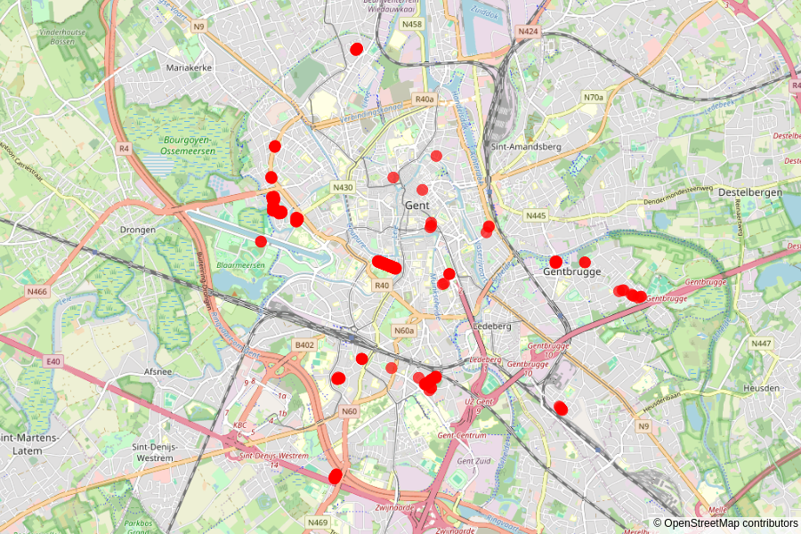
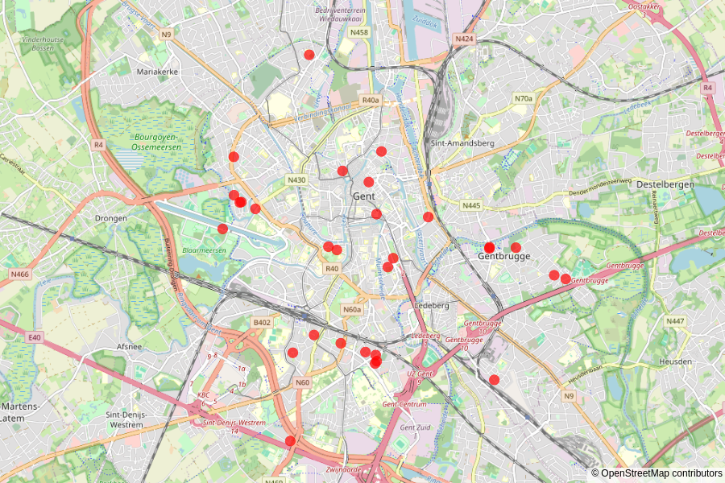
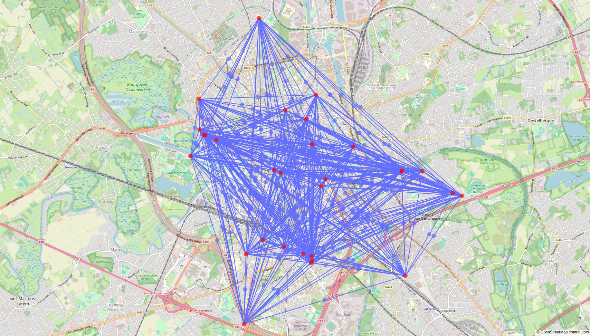
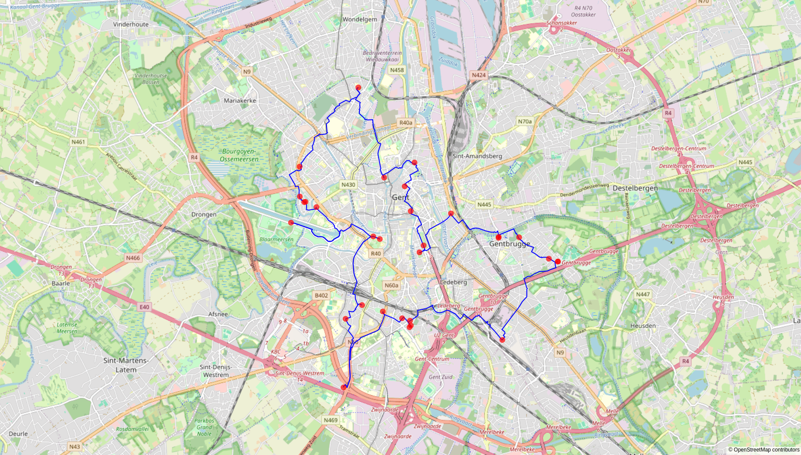

# Optimal path calculator for a sakura appreciation run

The blossoming of the Japanese cherry flower (Jap. *sakura*, Lat. *Prunus serrulata*) is quite a sight to behold.
In fact, it is so beautiful that we wanted to see *all* of them.
And though we're always in for a good run, there's *many* cherry trees in and around the city of Ghent...

The problem boils down to the following: what is the shortest route that links all the *sakura* trees in Ghent?
Or in other words, what is the path with maximal *sakura* appreciation value versus minimal distance to run?
A non-trivial problem...
Fortunately, there is SakuraRun to the rescue!

*[image source](https://www.morethantokyo.com/sakura-japans-cherry-blossoms/)*

### Input data, filtering, and clustering
The project starts from the [database](https://data.stad.gent/explore/dataset/locaties-bomen-gent/information/) holding the location, type, etc. of all trees in and around the city of Ghent, summing to a total of about 64k entries.
We select the species of *Prunus serrulata*, and filter out some of the more remote locations in the outskirts of the city.
The remaining number of entries is about 240, shown below:

Unfortunately, this number is still too large for calculating a realistic distance matrix and applying a shortest-path algorithm.
Hence we cluster the trees in the same street into a single entry, reducing their number to only 30:

### Calculating the distance matrix
Solving the shortest-path problem involves calculating the distance between each pair of points.
In order to get realistic distance estimates, we use [GraphHopper's](https://www.graphhopper.com/) [Matrix API](https://docs.graphhopper.com/#operation/postMatrix).

### Calculating the shortest path
The shortest path is calculated using the [python\_tsp](https://github.com/fillipe-gsm/python-tsp) package.
As an exact solution for this problem is intractable even for a very small number of points, several heuristics are used and compared against each other to check the solution.

### Calculating the details of the route
Once the optimal visiting order of the clusters has been determined, route details are calculated using GraphHopper's [Routing API](https://docs.graphhopper.com/#operation/postRoute).
The result is 33.229 km... Perhaps some more filtering is required...

### Integration into Google MyMaps
The `csv` files holding the filtered and clustered trees, and the final route in the form of a `kml` file, can be uploaded in Google MyMaps to create an [interactive view of the route](https://www.google.com/maps/d/edit?mid=1Lkx6-XZd_MD3Z8j-vJb9ecLbSvxTnj4&usp=sharing). This map also contains a more reasonable route of about 12 km, obtained by filtering a subset of the *sakura* clusters in the southern part of the city (Gent-Sint-Pieters - Citadelpark - Watersportbaan).

### Other results
This repo was originally developed for a sakura appreciation run in Ghent (Belgium), but it can be extended to any other place.
The only condition is the existence of a database with tree locations...

Currently, results have been obtained for:
- [Providence](https://github.com/LukaLambrecht/SakuraRun/tree/main/data/Providence) (RI, USA)
- [Boston](https://github.com/LukaLambrecht/SakuraRun/tree/main/data/Boston) (MA, USA) (to be updated)
