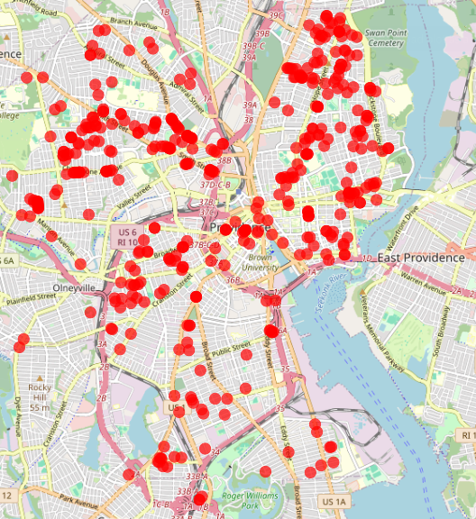
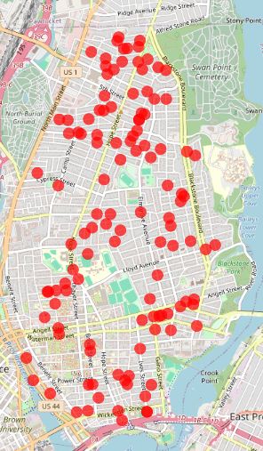
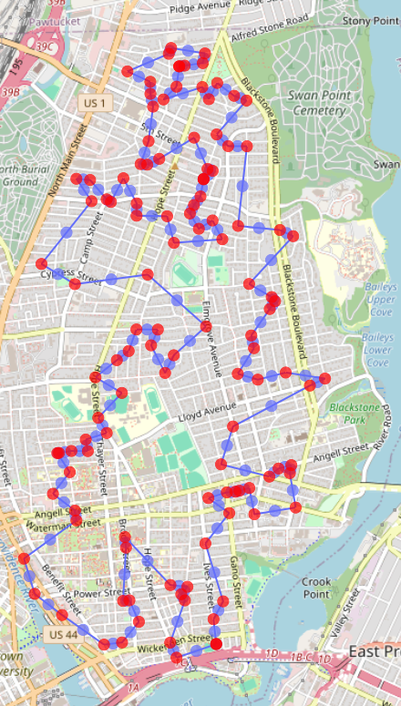
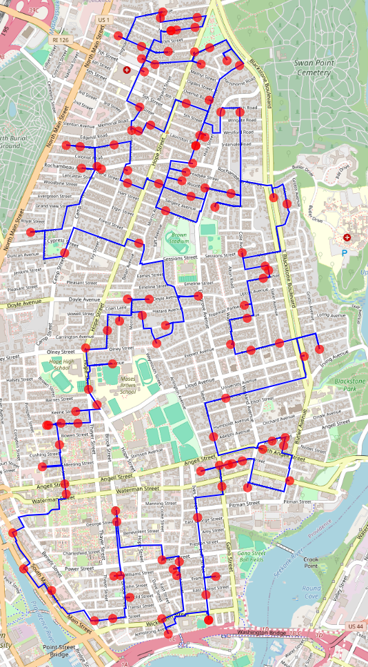

# Data and processing sequence for Providence (RI, USA)

### Raw data
The raw data can be retrieved from the [Providence Tree Inventory](https://data.providenceri.gov/Neighborhoods/Providence-Tree-Inventory/uv9w-h8i4/about_data).

### Data processing
The raw dataset contains 24,525 entries.  
After filtering on *Prunus serrulata* (including subtypes): 475 items remaining
(of which 36 do not have latitude / longitude coordinates added - ignore these for now).

After selecting only north-east section (College Hill): 166 items remaining.  
After clustering by street name: 76 items remaining.

### Shortest path calculation
The number of clustered items (76) is still too large for a full distance matrix calculation.
Instead, the geodesic approximation ('as the crow flies') is used, employing the haversine formula.
The shortest path according to this approximation is shown below.

The detailed route corresponding to this trajectory is shown below. Its total distance is 27.964 km.

An interactive map of this route can be found [here](https://www.google.com/maps/d/u/0/edit?mid=1rFmKRlpUEEuuJFzEooowr8raS5VHxHA&usp=sharing)
